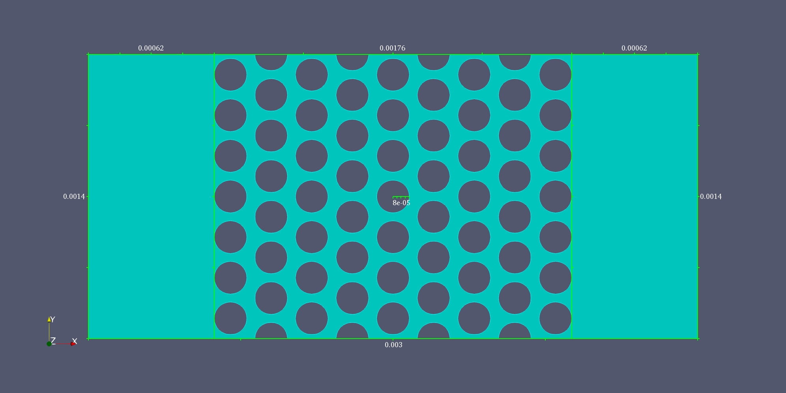

# Transport and retention of chemical scalars in porous media: a 2D CFD-based study at the pore-scale
Hillmert A. Solano, Faculty of Mines, Universidad Nacional de Colombia
## Presentation (video)

## 1. Introduction
The injection of taylored solutions with chemical scalars, such as polymers, surfactants, nanoparticles, salts;  is common in subsurface engineering applications. In hydrocarbon reservoirs, chemical scalars are injected to generate or favour different interactions that improve oil and gas production. On other vein, in Geological Carbon Sequestration (GCS), some studies have shown that scalars allows to increase carbon storage capacity in these operations. Additionally, chemical scalars are used to remove NAPL and solid pollulants from soil and groundwater bodies.

When a chemical scalar is injected into a porous medium, it follows some transport and retention dynamics by the interactions among other scalar particles/molecules (aggregation and disaggregation), the carrier fluid (transport phenomena), and the solid surface (surface phenomena), which govern its deployment. Hence, the understanding of the transport and retention dynamics allows to evaluate chemical species behaviour inside the porous medium, and therefore determine the most favourables conditions targeting better outcomes.

## 2. Methodology
This study is addressed under a CFD approach, enabling to evaluate transport and retention phenomena at the pore-scale considering a continuous medium in the pore space. The followed methodology is presented below:

### Problem Statement

Aiming to simplify this study, a 2D geometry 

Some assumptions are listed below:

<ul>
  <li>The concentration of the chemical scalar does not affect fluid viscosity.</li>
  <li>Tea</li>
  <li>Milk</li>
</ul>

<figure>
  
  <figcaption>Fig.1 - 2D Geometry used in this CFD study.</figcaption>
</figure>

### Mathematical Formulation and Dimensionless Variables

As mentioned above, the transport of a scalar depends strongly on fluid flow in the porous medium. For this reason, this formulation is divided into two problems: the first one is based on the fluid flow through the porous media; meanwhile the second one is associated with the chemical scalar transport.

#### Incompressible flow

In the first hand, the Navier-Stokes set of equations are used to model the fluid flow through the porous medium. By this approach, steady flow is considered, so the transient term is neglected. For a 2D problem, this is formed by 3 equations: one for fluid continuity and two for fluid momentum balance (one per dimension). By these equations, pressure and velocity distributions can be estimated for the spatial domain.

In order to delimite the mathematical problem regarding incompressible flow, initial and boundary conditions are proposed based on the problem statement. As an initial condition, zero velocity and a constant pressure are considered.

Regarding the boundary conditions, constant velocity and pressure zero grandient are considered as inlet boundary conditions.

Although, at the outlet boundary, constant pressure and velocity zero gradient, corresponding to an outlow-type condition. 

For the grains boundary, a non-slip condition is considered. In this condition, fluid velocity and pressure gradient are set as zero. 

Finally, upper and lower boundaries are considered as planes of symmetry. So, pressure, velocity, and their corresponding gradients are equal at the same distance from the planes.

Based on this mathematical model, two dimensionless numbers govern incompressible flow in the porous medium. Reybolds number is the ratio between intertial and viscous forces; meanwhile Ruark number corresponds to the ratio betweeen inertial and pressure forces.

<table>
  <caption style="text-align:right">Dimensionless numbers for scalar transport problem.</caption>
  <tr>
    <th>Dimensionless</th>
    <th>Definition</th>
    <th>Description</th>
  </tr>
  <tr>
    <td></td>
    <td></td>
    <td>Reynolds Number</td>
  </tr>
    <tr>
    <td></td>
    <td></td>
    <td>Ruark Number</td>
  </tr>
</table>
 

#### Chemical scalar transport
On the other hand, chemical scalar transport are modelled by the unsteady Advection-Diffusion (ADR) equation. By this equation, and with a predefined velocity field, the concentration field can be computed:

Following the same steps for the problem delimitation, a constant concentration field is considered as an initial condition of this problem:

As a boundary condition at inlet, a constant concentration is assumed:

Althought, a zero concentration gradient at the outlet is considered:

For the grains boundary, a model for retention is used to represent the surface phenomena. **Bueno et. al. (2020)** propose an schema based on an Langmuir-type retention model, in which attachment onto the surface depends on the chemical scalar concentration in the fluid and the retained concentration. So, this boundary condition can be expressed as follow:

Finally, as it was assumed for the incompresssible flow problem, upper and lower boundaries are considered as planes of symmetry for concentration too.

For the chemical scalar transport, there are three dimensionless numbers characterising the problem. Péclet number corresponds to the ratio between advection and diffusion fluxes; meanwhile both Damkhöler numbers are defined as ratios between attachment/detachment and diffusion fluxes.

<table>
  <caption style="text-align:right">Dimensionless numbers for incompressible flow problem.</caption>
  <tr>
    <th>Dimensionless</th>
    <th>Definition</th>
    <th>Description</th>
  </tr>
  <tr>
    <td></td>
    <td></td>
    <td>Péclet Number</td>
  </tr>
    <tr>
    <td></td>
    <td></td>
    <td>Damkhöler Number (Attachment) </td>
  </tr>
  <tr>
    <td></td>
    <td></td>
    <td>Damkhöler Number (Detachment) </td>
  </tr>
</table>
 

<figure>
  
  <figcaption>Fig.1 - Trulli, Puglia, Italy.</figcaption>
</figure>

### Meshing and solution schemes

## 3. Results

## 4. Conclusions

## 5. References

## Appendix A. Mesh independence study

## Appendix B. Model Validation

## Appendix C. Convergence Evaluation

## Appendix D. 
