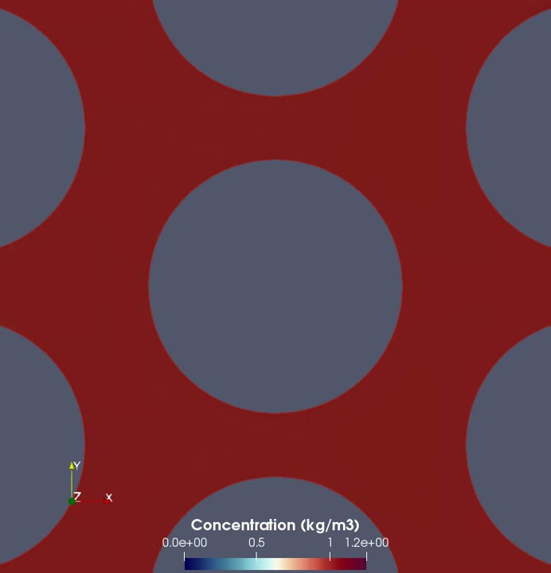
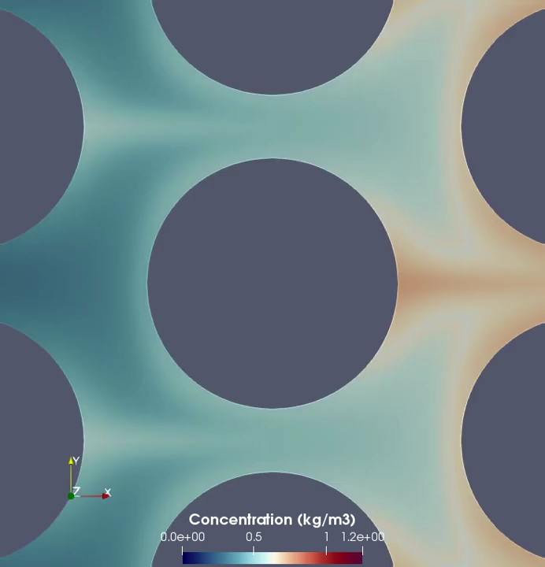

# Transport Dynamics of Chemical Species in Porous Media: a 2D CFD study at the pore-scale
Hillmert A. Solano
## Presentation (video)

## 1. Introduction
The injection of tailored solutions with chemical scalars; such as polymers, surfactants, nanoparticles, salts, and others;  has become very common in subsurface engineering applications. Enhanced Oil Recovery (EOR) operations are a good example of these applications, in which chemical scalars use to be injected to generate or favour different interactions that improve oil and gas production. On another vein, the remotion of non-aqueous liquid phases (NAPL) and solid pollutants from soil and groundwater bodies can be improved using chemical scalars. Furthermore, recent studies show a positive impact on the carbon dioxide storage capacity when a Geological Carbon Sequestration (GCS) operation is upgraded by the use of chemical scalars. All above accounts for the importance of the study of chemical scalar behaviour in porous media targeting to improving its understanding and the design process of these operations.

One of the most important issues involved in the behaviour of chemica scalars in porous media are the transport phenomena. When a chemical scalar is injected into a porous medium, several transport mechanisms are followed. These mechanisms are strongly associated with its interactions with other scalar particles/molecules, the carrier fluid, and the solid surface; and govern its deployment inside the porous medium. With this in mind, a proper representation of the transport dynamics exhibed by the chemical scalars inside the porous media is key to design a subsurface engineering application involving chemical scalars.

This work is focused on the phenomenological study of transport dynamics followed by chemical scalars in porous media. In order to address this objective, a CFD framework-based study is carried out. Firstly, the methodology is presented, including the problem statement, the mathematical formulation and the main variables leading to the transport dynamics, meshing and solution schemes, and the description of the numerical experiments run in this work. Subsequently, the obtained results are discussed assessing the impact of the chemical scalars features on the transport behaviour. Finally, some conclusions are presented. Furthermore, some annexes with more detailed information regarding the CFD approach are referenced.

## 2. Methodology
Under a CFD approach, this study follows a phenomenological methodology (**Bear, 2018**) that is presented below.

### Problem Statement

Aiming to simplify the problem, but keeping in mind the objectives of this study, a 2D geometry is proposed. This geometry contains a regular porous medium in the middle formed by circular grains as shown in Figure 1. The study is delimited to the injection of a chemical scalar concentration dispersed in a single phase fluid through the inlet port. This scalar is transported inside the spatial domain and exits at the outlet port. Inside the porous medium, the chemical scalars follows the carrier fluid flow by the *advection* mechanism. In addition, concentration gradients in the medium lead to a scalar transport towards the regions with less concentration by *molecular diffusion*.

Transversaly, when the chemical scalars reach the porous medium, surface-level interactions generate a mass scalar flux from or towards the rock surface (**Bueno et. al., 2019**, **Boccardo et. al., 2017**). The rate and the direction of this flux depends on the solid surface composition, chemical nature of the specie, chemical and dynamic properties of the carrier fluids, and concentrations in the fluid and retained onto the surface.

<figure>
  
  
  <figcaption>Fig.1 - 2D Geometry used in this CFD study. All dimensions are in meters.</figcaption>
    
</figure>

Some assumptions are listed below:

<ul>
  <li>The carrier fluid behaves as a Newtonian fluid (i.e. viscosity is not a function of the shear rate).</li>  
  <li>Flow regime is laminar (low Reynolds numbers).</li>
  <li>The concentration of the chemical scalar does not affect fluid viscosity (low concentration).</li>
  <li>The concentration of the chemical scalar does not affect diffusivity (Fickian mass transport).</li>
  <li>Diffusion coefficient is constant for all points in the space and all directions.</li>
  <li>There is no energy transport mechanism affecting the mass and momentum transports.</li>
</ul>

### Mathematical Formulation and Dimensionless Variables

As mentioned above, the transport of a scalar depends strongly on fluid flow in the porous medium. For this reason, this formulation is divided into two problems: the first one is based on the fluid flow through the porous media; meanwhile the second one is associated with the chemical scalar transport.

#### Incompressible flow

The widely known Navier-Stokes equations are used to model the fluid flow through the porous medium. By this approach, steady flow is considered, so the transient term is neglected. For a 2D problem, this is formed by 3 equations: one for fluid continuity and two for fluid momentum balance (one per dimension). By these equations, pressure and velocity distributions can be estimated for the spatial domain.

where  is the j-component of the flow velocity vector,  is the kinematic viscosity of the fluid,  is the fluid density, and  is the pressure.

In order to delimite the mathematical problem regarding incompressible flow, initial and boundary conditions are proposed based on the problem statement. As an initial condition, zero velocity and a constant pressure are considered.

where  is the initial pressure considered for the experiments. 

Regarding the boundary conditions, constant velocity and pressure zero grandient are considered as inlet boundary conditions.

where  is the injection velocity at the inlet port. 

Although, at the outlet boundary, constant pressure and velocity zero gradient, corresponding to an outlow-type condition. 

For the grains boundary, a non-slip condition is considered. In this condition, fluid velocity and pressure gradient are set as zero. 

Finally, upper and lower boundaries are considered as axes of symmetry. So, pressure, velocity, and their corresponding gradients are equal at the same distance from the planes.

Based on this mathematical model, two dimensionless numbers govern incompressible flow in the porous medium. Reynolds number is the ratio between intertial and viscous forces; meanwhile Ruark number corresponds to the ratio betweeen inertial and pressure forces. Others dimensionless numbers commonly obtained from the Navier-Stokes equations, like Froude and Darcy numbers, are neglected because gravitational component and fluid compressibility are not considered.

<table>
  <caption style="text-align:right">Tab 1. Dimensionless numbers for incompressible flow problem.</caption>
  <tr>
    <th>Dimensionless</th>
    <th>Definition</th>
    <th>Description</th>
  </tr>
  <tr>
    <td></td>
    <td></td>
    <td>Reynolds Number</td>
  </tr>
    <tr>
    <td></td>
    <td></td>
    <td>Ruark Number</td>
  </tr>
</table>
 

#### Chemical scalar transport
On the other hand, chemical scalar transport are modelled by the unsteady Advection-Diffusion (ADR) equation. By this equation, and with a predefined velocity field, the concentration field can be computed:

where  is the scalar concentration in the fluid and  is the mass diffusion coefficient of the specie in the fluid.

Taking into account that reactions are neglected and Reynold number is low; the approximation proposed by Stokes-Einstein can be used to estimate the mass diffusion coefficient. 

where  is the Boltzman constant (1.38e-23 J/K) and  is the diameter of the specie.

Following the same steps for the problem delimitation, a constant concentration field is considered as an initial condition of this problem:

where  is the initial concentration along the spatial domain. 

As a boundary condition at inlet, a constant concentration is assumed:

where  is the concentration at the injection port.

Althought, a zero concentration gradient at the outlet is considered:

For the grains boundary, a model for retention is used to represent the surface phenomena. **Bueno et. al. (2020)** propose an schema based on an Langmuir-type retention model, in which attachment onto the surface depends on the chemical scalar concentration in the fluid and the retained concentration. So, this boundary condition can be expressed as follow:

where  is the retained concentration onto the solid surface, 
where  is the solid surface capacity, 
where  and  are the kinetic constants representing respectively attachment and detachment rates of the scalar onto/from the rock surface.

The solid surface capacity can be estimated based on a surface occupancy by the next equation:

where  is the diameter of the specie,  is the surface area to porous volume ratio, and  is the specie density.

Finally, as it was assumed for the incompresssible flow problem, upper and lower boundaries are considered as axes of symmetry for concentration too.

For the chemical scalar transport, there are three dimensionless numbers characterising the problem. Péclet number corresponds to the ratio between advection and diffusion fluxes; meanwhile both Damkhöler numbers are defined as ratios between attachment/detachment and diffusion fluxes.

<table>
  <caption style="text-align:right">Dimensionless numbers for scalar transport problem.</caption>
  <tr>
    <th>Dimensionless</th>
    <th>Definition</th>
    <th>Description</th>
  </tr>
  <tr>
    <td></td>
    <td></td>
    <td>Péclet Number</td>
  </tr>
    <tr>
    <td></td>
    <td></td>
    <td>Damkhöler Number (Attachment) </td>
  </tr>
  <tr>
    <td></td>
    <td></td>
    <td>Damkhöler Number (Detachment) </td>
  </tr>
</table>
 

### Meshing

To solve numerically the problem, a quad-based mesh is generated using the **ANSYS ICEM CFD** software, which is shown in Figure 2. This mesh is refined in the most conflictive regions to guarantee a proper set of mesh quality indicators. Table 3 shows the features of the generated mesh.

<figure>
  
  <figcaption>Fig.2- 2D Geometry used in this CFD study. All dimensions are in meters.</figcaption>
</figure>
  

<table>
  <caption style="text-align:right">Table 3. Mesh features.</caption>
  <tr>
    <th>Dimensions of grid</th>
    <th>Number of points</th>
    <th>Number of cells</th>
    <th>Number of faces</th>
  </tr>
  <tr>
    <td>2</td>
    <td>245 093</td>
    <td>238 806</td>
    <td>483 957</td>
  </tr>
</table>
 

A mesh independence assessment is presented in the Annex 1. 

### Solution schemes

Both problems, the incompressible flow and scalar transport ones, are solved using OpenFOAM, a widely recognised open source package for CFD applications with a Finite Volume-based framework.

#### Incompressible Flow

The incompressible flow problem is solved using the simpleFoam solver, which follows the Semi-Implicit Method for Pressure Linked Equations (SIMPLE) algorithm to estimate the velocity and pressure fields in the spatial domain. This algorithm shows a better performance with respect to the other ones available in OpenFOAM at the conditions of the experiments. The above is concluded from a convergence study presented in the Annex 2. 

The numerical solution schemes for this problem are presented below in Table 3.

<table>
  <caption style="text-align:right">Table 3. Numerical solution features for the incompressible flow problem.</caption>
  <tr>
    <th>Feature</th>
    <th>Scheme</th>
  </tr>
  <tr>
    <td>Transient term Scheme</td>
    <td>Steady State</td>
  </tr>  
  <tr>
    <td>Gradient Scheme</td>
    <td>Gauss linear</td>
  </tr>  
  <tr>
    <td>Divergence Scheme</td>
    <td>Bounded Gauss Linear Upwind for velocity gradient</td>
  </tr>  
  <tr>
    <td>Laplacian Scheme</td>
    <td>Gauss linear corrected</td>
  </tr>
  <tr>
    <td>Linear solver por velocity</td>
    <td>Smooth solver with Gauss-Seidel smoother</td>
  </tr>
  <tr>
    <td>Linear solver por pressure</td>
    <td>GAMG with Gauss-Seidel smoother</td>
  </tr>
</table>
 

#### Scalar Transport

The chemical specie transport problem is solved using the scalarTransportFoam solver. Particularly, the adaptation developed by the the ***Multiscale Modelling and Heterogeneous Media group*** of the University of Nottingham is used because it includes a proper boundary condition represention for the retention dynamics onto solid surfaces based on Langmuir kinetic and others (**Bueno et. al. 2020**). **Bueno et. al. 2020** shows a more detailed information respect to the implementation of this computational model.

The numerical solution schemes for this problem are presented below in Table 4.

<table>
  <caption style="text-align:right">Table 4. Numerical solution features for the scalar transport problem.</caption>
  <tr>
    <th>Feature</th>
    <th>Scheme</th>
  </tr>
  <tr>
    <td>Transient term Scheme</td>
    <td>Euler</td>
  </tr>  
  <tr>
    <td>Gradient Scheme</td>
    <td>Gauss linear</td>
  </tr>  
  <tr>
    <td>Divergence Scheme</td>
    <td>Bounded Gauss Linear Upwind for velocity gradient</td>
  </tr>  
  <tr>
    <td>Laplacian Scheme</td>
    <td>Gauss linear corrected</td>
  </tr>
  <tr>
    <td>Linear solver</td>
    <td>PBiCGStab with DILU precondicioner</td>
  </tr>
</table>
 

## 3. Experiments and Results

### Incompressible flow

The incompressible flow simulation is run using the input data presented in Table 5. Its results are used as input in the scalar transport experiments in order to evaluate the transport dynamics of the chemical scalar. 

<table>
  <caption style="text-align:right">Table 5. Input data used for the incompressible flow simulation.</caption>
  <tr>
    <th> (m/s) </th>
    <th> (Pa) </th>
    <th> ()</th>
    <th> ()</th>
    <th> </th>
    <th> </th>
</tr>
  <tr>
    <td>3.53e-06</td>
    <td>0.00e+00</td>
    <td>1.00e-06 </td>
    <td>1.00e+03 </td>
  </tr>
</table>

From this CFD simulation, velocity and pressure fields are obtained. Figure 3 shows the pressure heatmap obtained by simulation. This plot shows that pressure gradient between the inlet port and the outlet port is caused mainly by the flow dynamics in the porous media, which is expected considering the Darcy's law. Based on this phenomenological law, a validation of the flow model is presented in the Annex 3.

<figure>
  <table border="0">
  <tr>
    <th> </th>
</tr>
</table>
  <figcaption>Fig.3- Pressure field obtained from the incompressible flow simulation.</figcaption>   
</figure>

On another vein, Figure 4 shows the velocity magnitude heatmap with a set of streamlines obtained by postprocessing; while Figure 5 contains two cartesian plot of the velocity magnitude along a vertical and an horizontal axes located at x=0.0009m and y=0.0007m respectively. Both figures shows that there are local gradients of velocity magnitude in the pore throats. These gradients can be explained by momentum transfers due to viscous forces between two no-slipping walls in each throat, in which the maximum velocity is reached at the middle point of the pore throat and a zero-relative velocity at the walls. 

Furthermore, the plotted streamlines show a preferential trend in following the direction of the pressure gradient. Comparing with the velocity heatmap, it can be concluded that the higher velocity magnitudes correspond to the zones with greater streamlines densities. For this reason, high-velocity zones lead to preferential flow paths in the porous medium.

<figure>
  <table border="0">
  <tr>
    <th> </th>
    <th></th>
</tr>
</table>
  <figcaption>Fig.4- Velocity field obtained from the incompressible flow simulation. Left: whole image, right: zoomed. In the pictures, some streamlines are plotted. </figcaption>  
</figure>

<figure>
  <table border="0">
  <tr>
    <th> </th>
    <th> </th>
</tr>
</table>
  <figcaption>Fig.5-  Cartesian plots of velocity vs. distance along two different axes. Left: x=0.0009m (vertical), right: y=0.0007 (horizontal).</figcaption>  
</figure>

From the above, the outcomes obtained from the incompressible flow simulation are consistents and can be applied to run the scalar transport simulations.

### Scalar Transport

In order to address this study, a set of seven numerical experiments was run. The corresponding dataset is presented in Table 6. In order to address this study, a set of seven numerical experiments was run. The corresponding dataset is presented in Table 6. Experiment 1 simulates a hypothetical case where transport mechanisms by diffusion and retention dynamics are neglected, so the advection governs the chemical species transport across the porous medium. Although, Experiments 2, 3, and 4 corresponds to cases for a specific chemical species size neglecting retention dynamics. Finally, Experiments 5, 6, and 7 simulate the same cases of the three last ones considering a retention rate. 
  
<table>
  <caption style="text-align:right">Table 6. Input data used for the numerical experiments.</caption>
  <tr>
    <th>ID</th>
    <th>Diameter (nm) </th>
    <th> (1/s) </th>
    <th>D () </th>
    <th> ()</th>
    <th> </th>
    <th> </th>
    <th>Animation </th>
    <th>Animation (zoomed) </th>
</tr>
  <tr>
    <td> 1</td>
    <td>- </td>
    <td>0.00e+00 </td>
    <td>0.00e+00 </td>
    <td>- </td>
    <td>- </td>
    <td>0.00e+00 </td>
    <td>
<a href="https://www.youtube.com/watch?v=UbzHim_1x0U">Video</a>
 </td>
    <td>
<a href="https://www.youtube.com/watch?v=TBKmxifALT0">Video</a>
 </td>
  </tr>
  <tr>
    <td> 2</td>
    <td>10 </td>
    <td>0.00e+00 </td>
    <td>4.32e-11 </td>
    <td>3.67e-01 </td>
    <td>20.53 </td>
    <td>0.00e+00 </td>
    <td>
<a href="https://www.youtube.com/watch?v=tC7wnuEwXq8">Video</a>
 </td>
    <td>
<a href="https://www.youtube.com/watch?v=EtOTb5CJTCc">Video</a>
 </td>
  </tr>
  <tr>
    <td> 3</td>
    <td> 50</td>
    <td>0.00e+00 </td>
    <td>8.64e-12 </td>
    <td>1.83e+00 </td>
    <td>102.65 </td>
    <td>0.00e+00 </td>
    <td>
<a href="https://www.youtube.com/watch?v=xm6KSwjxmQY">Video</a>
 </td>
    <td>
<a href="https://www.youtube.com/watch?v=TTHVxNuWjdI">Video</a>
 </td>
  </tr>
  <tr>
    <td>4</td>
    <td>100</td>
    <td>0.00e+00 </td>
    <td>4.32e-12 </td>
    <td>3.67e+00 </td>
    <td>205.30 </td>
    <td>0.00e+00 </td>
    <td>
<a href="https://www.youtube.com/watch?v=PmyAC1zPRU8">Video</a>
 </td>
    <td>
<a href="https://www.youtube.com/watch?v=EVIjJY_LxTg">Video</a>
 </td>
  </tr>
  <tr>
    <td>5</td>
    <td>10</td>
    <td>1.00e-07 </td>
    <td>4.32e-11 </td>
    <td>3.67e-01 </td>
    <td>20.53 </td>
    <td>1.46e-04 </td>
    <td>
<a href="https://www.youtube.com/watch?v=KaFeWjrQV3U">Video</a>
 </td>
    <td>
<a href="https://www.youtube.com/watch?v=vnQHHuDpRXo">Video</a>
 </td>
  </tr>
  <tr>
    <td>6</td>
    <td>50</td>
    <td>1.00e-07 </td>
    <td>8.64e-12 </td>
    <td>1.83e+00 </td>
    <td>102.65 </td>
    <td>7.31e-04 </td>
    <td>
<a href="https://www.youtube.com/watch?v=9jOkrxBxqAg">Video</a>
 </td>
    <td>
<a href="https://www.youtube.com/watch?v=jwDzBNLhNRY">Video</a>
 </td>
  </tr>
  <tr>
    <td>7</td>
    <td>100</td>
    <td>1.00e-07 </td>
    <td>4.32e-12 </td>
    <td>3.67e+00 </td>
    <td>205.30 </td>
    <td>1.46e-03 </td>
    <td>
<a href="https://www.youtube.com/watch?v=g_SVaWlDfDA">Video</a>
 </td>
    <td>
<a href="https://www.youtube.com/watch?v=rdLdOiCMbxo">Video</a>
 </td>
  </tr>
</table>
 

The next schedule is simulate for all of the proposed experiments:

<ul>
  <li> Injection of a fluid with a dispersed concentration of  between 0s to 1200s.
  <li> Injection of a fluid with a dispersed concentration of  between 1200s to 2400s.
</ul>
  
A time-step of 6s has been chosen for all simulations. Annex 4 presents a time-step independence analysis that concludes that this value is proper to this type of simulation.

### Effect of the diffusion on the chemical specie transport

Figure 6 presents a set of screenshots obtained from the simulation video zoomed to pore scale for Experiments 1 and 3. These screenshots are obtained at t=480 s (during the dispersion injection), t=1200 s (when the dispersion injection stops), and t=1680 s (during fresh fluid injection) for both cases. 

<figure>
  <table border="0">
  <tr>
    <th> </th>
    <th> </th>
    <th> </th>
</tr>
  <tr>
    <th>Experiment 1. 480 s. </th>
    <th>Experiment 1. 1200 s. </th>
    <th>Experiment 1. 1680 s. </th>
</tr>
<tr>
    <th> </th>
    <th> </th>
    <th> </th>
</tr>
  <tr>
    <th>Experiment 3. 480 s. </th>
    <th>Experiment 3. 1200 s. </th>
    <th>Experiment 3. 1680 s. </th>
</tr>
</table>
  <figcaption>Fig.6-  Screenshot obtained from simulation corresponding to Experiment 1 (upper) and Experiment 3 (lower). For each experiment, the screeshots correspond to 480 s (left), 1200 s (centre), and 1680 s (right). </figcaption>
     
</figure>

In the upper plots, corresponding to the non-diffusion case, species trends to be transported across the high streamlines’ density zones. Then, when these regions reach a species concentration equal to the injection one, the species begins to be transported toward low streamlines’ density zones reaching concentration greater than the injection ones. This particularity is associated with the low transport potential in these regions caused by the low flow potential, generating species cumulation. In contrast, when diffusion is considered, the maximum concentration reached in the whole porous space corresponds to the injection one.  The presence of the mass diffusion mechanisms enables species transport towards the low streamlines’ density regions and avoids a cumulation in these regions. 

This comparison shows the importance of the mass diffusion on transport in porous media, which affects the species deployment at the pore scale. However, it is necessary to evaluate if this issue has an important effect on the outcomes according to the specific operation.

### Effect of the size of the chemical species transport

### Effect of the size of the chemical scalar without retention

<figure>
    <table border="0">
  <tr>
    <th> </th>
    <th> </th>
</tr>
<tr>
    <th>Without retention. </th>
    <th>With retention. </th>
</tr>
  <figcaption>Fig.7-  Comparison between cases without and with retention for a species size of 50 nm. Each plot shows the evolution of the concentration profile along the horizontal axis at y=0.0007m. </figcaption>
     
</figure>
  
  

## 4. Conclusions

## 5. References

## Appendix A. Mesh independence study

## Appendix B. Model Validation

## Appendix C. Convergence Evaluation

## Appendix D. 
