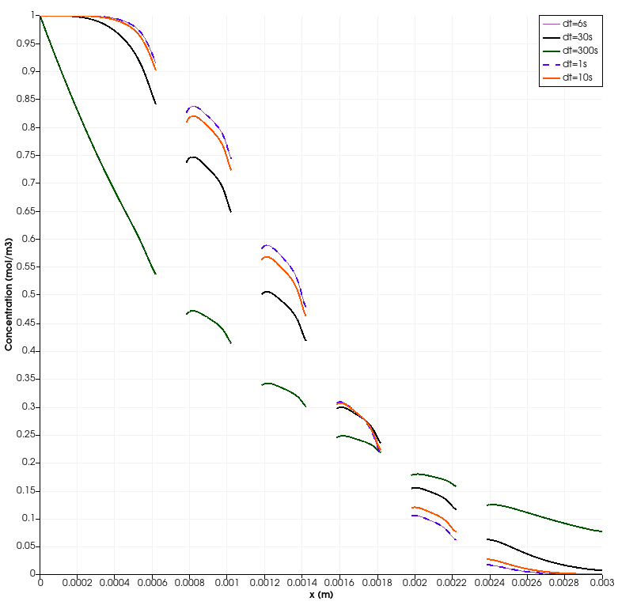
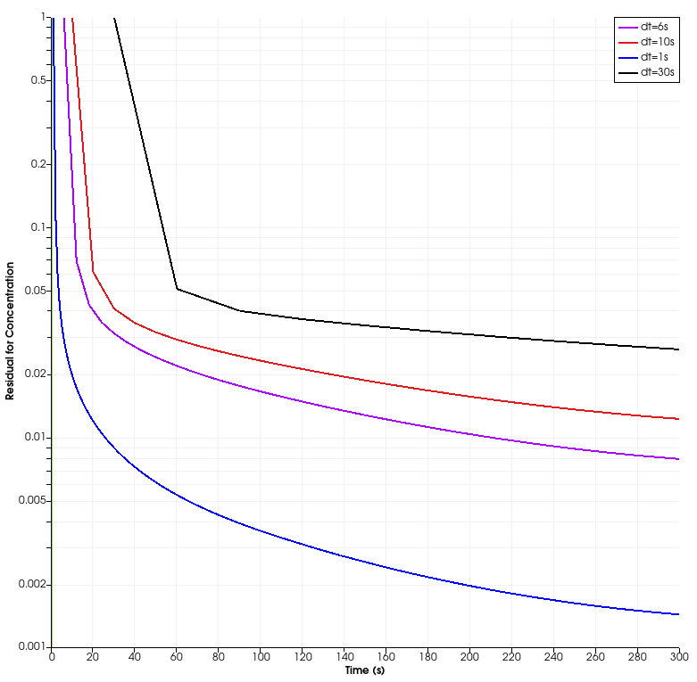

# Appendix: Evaluation of the timestep independence regarding chemical scalar transport and retention problem

In order to select a proper timestep in the proposed CFD simulations, a previous evaluation of time step independence is carried out. Keeping this in mind, the proposed numerical experiment framework is run until 300 s for several timesteps. Then, the results are post-processed and a concentration profile over a horizontal axis (parallel to x-axis) is obtained for each considered timestep. These results are used to find the best timestep to run the simulations proposed in this project.

The timestep values used in this evaluation are presented below:

<table style="width:100%">
  <tr>
    <th>Steps</th>
    <th>Timestep (s)</th>
    <th>Mean Courant</th>
    <th>Max. Courant</th>
  </tr>
    <td>1</td>
    <td>300</td>
    <td>575.96</td>
    <td>6073.88</td>
  </tr>
  <tr>
    <td>10</td>
    <td>30</td>
    <td>57.596</td>
    <td>607.388</td>
  </tr>
  <tr>
    <td>30</td>
    <td>10</td>
    <td>19.1987</td>
    <td>202.463</td>
  </tr>
  <tr>
    <td>50</td>
    <td>6</td>
    <td>11.5192</td>
    <td>121.478</td>
  </tr>
  <tr>
    <td>300</td>
    <td>1</td>
    <td>1.91987</td>
    <td>20.2463</td>
  </tr>
</table>

Then, the concentration profiles over the horizontal axis at y=0.007m is presented below:

<figure>
  
  <figcaption>Figure. Concentration profile over a horizontal axis at y=0.0007m.</figcaption>
</figure>

From the previous plot, different concentration profiles for this problem are obtained for several timestep values. However, when the timesteps increase, the corresponding profiles trend to a particular one. In this way, the concentration profiles for 6 seconds lower timesteps are equals. Hence, a timestep lower than **6 seconds** ensures timestep independence in this problem. This value is used for the CFD simulations.

Then, the residuals logs for each timestep are presented below:

<figure>
  
  <figcaption>Figure. Residuals obtained from the simulations varying the timestep.</figcaption>
</figure>

Even though a 1 second timestep enables lower residuals with respect to the 6 second one, the difference between both concentration profiles is lower. Therefore, the difference between both residuals does not affect the simulation output. 

